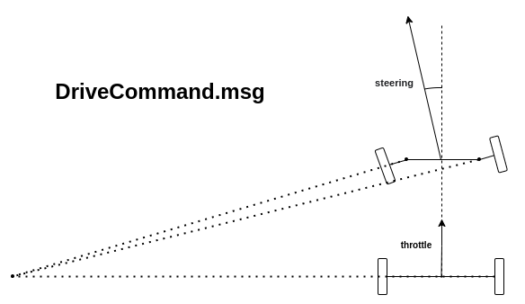

# quasor_interfaces

This package contains the custom ROS interfaces for the Quasor project.

## DriveCommand.msg

## ArmRanges.msg
Message which includes ranges from all four ultrasonic sensors on the arm combined into a single message.

Range values are in metres.

## ArmForces.msg
Message which includes brush forces from the two load cells on the arm combined into a single message.

Force values are in newtons.

## Contributing

To edit the diagrams in this README.md, open the raw files in quasor_interfaces/images/draw.io/ using [draw.io](https://www.draw.io/), make changes, and export as PNG. Some diagrams are then cropped using any image edit tool to the right size.
